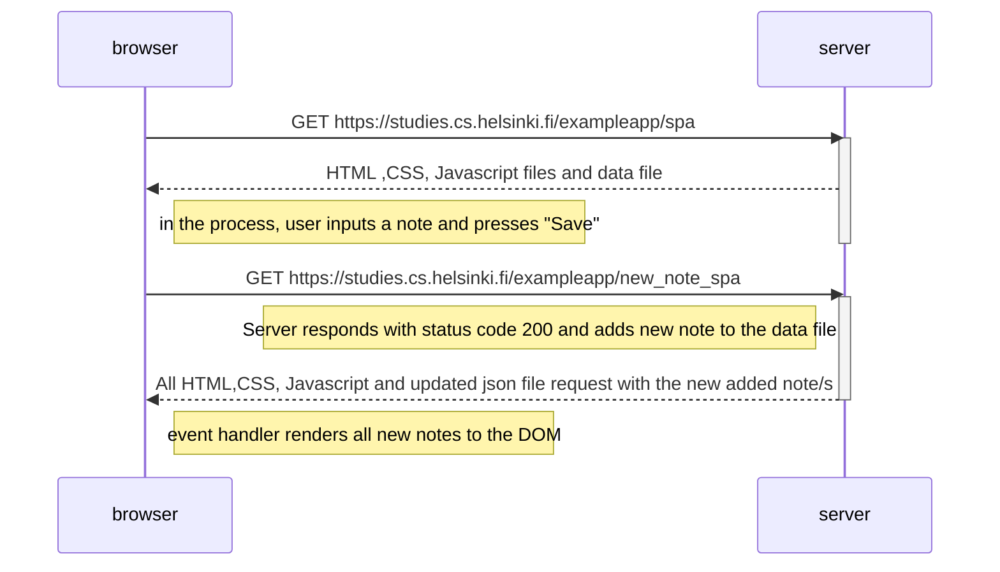

```mermaid
sequenceDiagram
    participant browser
    participant server

    browser->>server: GET https://studies.cs.helsinki.fi/exampleapp/spa
    activate server
    server-->>browser: HTML ,CSS, Javascript files and data file 
    Note right of browser: in the process, user inputs a note and presses "Save"
    deactivate server

    browser->>server: GET https://studies.cs.helsinki.fi/exampleapp/new_note_spa
    activate server
    Note left of server: Server responds with status code 200 and adds new note to the data file
    server-->>browser: All HTML,CSS, Javascript and updated json file request with the new added note/s
    deactivate server
    Note right of browser: event handler renders all new notes to the DOM

```